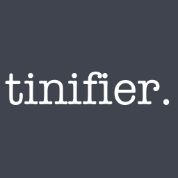

# 

A simple GUI to access the Tinify API, courtesy of [TinyPNG](https://tinypng.com).

Requires a developer key (free to get) in order to connect to TinyPNG's web services.

GUI environment (multi-platform) developed by [Fyne](https://fyne.io).

Licensed under a [MIT License](https://gwyneth-llewelyn.mit-license.org/).

## Purpose

TinyPNG allows, through their nifty [Tinify API](https://tinypng.com/developers), access to a few more goodies which are not possible from the usual web-based interface — such as resizing images and compressing images bigger than the 5MB limit.

In order to keep usage within reasonable limits, similar to what happens on the web page, you cannot abuse the system. And, most importantly, the API requires a unique key. Registration is
free.

## Minimalist compiling/development instructions:

Most of these instructions are required to use the GUI framework [Fyne](https://fyne.io) and dealing with cross-compilation & packaging.

Under Linux, Fyne seems to prefer to run under X (so you will need X-related development files) _and_
[something extremely important to be inserted here but which I totally
forgot about].

1. Make sure you have your dependencies for Fyne (which is based on OpenGL) correctly set up:

-   For macOS: Install the [XCode command-line tools](https://developer.apple.com/download/all/?q=Command%20Line%20Tools%20for%20Xcode) appropriate for your macOS version; additionally: `brew install freeglut` (and possibly `glew` as well)
-   For Linux (Debian/Ubuntu): `apt install libx11-dev libxcursor-dev libgl-dev libglfw3-dev libxrandr-dev libxinerama-dev libxi-dev libxxf86vm-dev`
-   For Windows: no idea whatsoever...

2. Compile as usual, e.g. `go build .`
3. Optionally, create whatever packages you need for the different operating systems, and use the `fyne` command-line tool, which you can install with `go get fyne.io/fyne/v2/cmd/fyne` (on the same directory where you're working on this repo)

Because Fyne has some OpenGL dependencies, and these are different from system to system, you will need to have the adequate libraries for cross-compilation.

Here is an example: [compiling in macOS or Linux/Debian, target is Windows 64bits](https://stackoverflow.com/a/36916044/1035977):

1. `brew install mingw-w64` (macOS, Darwin); or
2. `apt install mingw-64` (Debian, Ubuntu)
3. `env GOOS="windows" GOARCH="amd64" CGO_ENABLED="1" CC="x86_64-w64-mingw32-gcc"`

## Disclaimer

I'm not affiliated with TinyPNG nor paid to endorse their products and/or services; I'm just a very regular user
and an unconditional fan of their insanely advanced image compression
algorithms!

Please bear with me while I study how Fyne works. I'm still amazed at how
much you can do with it, looking so awesome in different platforms. And yet,
it completely falls under the radar for multiplatform development — I wonder
why!
